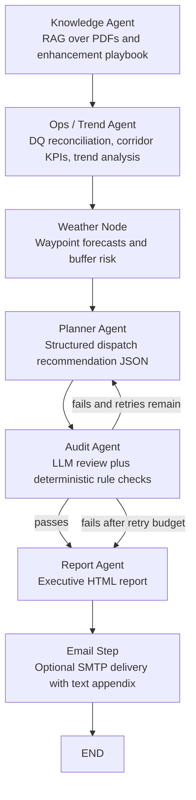

# MSBA AI Agents Demo (LangGraph + LangChain)

This project extends the original SeeWeeS dispatch-reporting prototype into a more robust multi-agent workflow for the UCLA MSBA AI Agents Project Challenge 2026.

The implementation in this repo primarily targets:
- `Idea 1: Self-Correction & Quality Assurance`
- `Idea 3: Deep-Dive Trend Analysis`

The repo also includes early multi-corridor groundwork related to `Idea 5`, but full resource-allocation logic is not part of the current reporting flow.

Planner and report context is filtered to keep the implementation scope concise and keep audit behavior aligned with the chosen Ideas 1 and 3 scope.

## What This System Does

The current system:
- indexes multiple knowledge sources with RAG, including the original playbook PDF, the enhancement markdown playbook, and a supporting company PDF
- separates retrieved policy evidence from appendix/reference evidence
- reconciles dirty shipment data against appendix rules for aliases, legacy IDs, missing identifiers, and unresolved records
- computes period-over-period shipment trends, corridor mix, correction/exclusion breakdowns, and item-level spike analysis
- generates a planner recommendation
- runs an audit loop that can reject the planner output and force a retry before reporting
- generates a leadership-style HTML report with a compact weather route snapshot and corridor KPI comparison
- creates a separate deep-dive text appendix for detailed reconciliation, exclusion, correction, and trend tables
- can optionally email the report and appendix through SMTP
- records a lightweight RAG evaluation with `Recall@k` and grounded-answer accuracy

## Challenge Alignment

### Idea 1: Self-Correction & Quality Assurance

Implemented:
- dedicated `Audit Agent`
- cyclic planner-to-audit retry loop
- deterministic audit checks for weather-buffer compliance
- required evidence/citation checks
- controlled failure mode if audit issues remain after retry budget is exhausted

### Idea 3: Deep-Dive Trend Analysis

Implemented:
- appendix-driven identifier reconciliation
- alias and legacy-ID correction
- exclusion logging with reason codes
- valid vs excluded shipment accounting
- planning-window vs history comparisons
- corridor-level and item-level trend summaries
- deep-dive appendix tables for corrected samples, unresolved samples, exclusions, and item spikes

## LangGraph Flow



1. `Knowledge Agent`
   Retrieves policy and reference evidence from the indexed documents.
2. `Ops / Trend Agent`
   Turns deterministic CSV reconciliation and analytics outputs into business insight.
3. `Weather Node`
   Retrieves waypoint-level weather risk and applies the playbook buffer mapping.
4. `Planner Agent`
   Produces a structured dispatch recommendation in JSON.
5. `Audit Agent`
   Verifies rule compliance, evidence support, and required buffer logic.
6. `Report Agent`
   Produces the final HTML leadership report and a separate deep-dive appendix.
7. `Email Step` (optional)
   Sends the report and appendix via SMTP if email environment variables are configured.

## Key Files

- `src/main.py`
  Entry point for the end-to-end workflow.
- `src/graph.py`
  LangGraph state machine and node orchestration.
- `src/agents.py`
  LLM-backed agent execution helpers.
- `src/prompts.py`
  Prompt definitions for knowledge, ops, planner, audit, and report agents.
- `src/tools/pdf_tools.py`
  Multi-source RAG indexing and retrieval.
- `src/tools/knowledge_tools.py`
  Structured appendix parsing and RAG evaluation.
- `src/tools/csv_tools.py`
  Shipment reconciliation, DQ handling, KPI computation, and trend analysis.
- `src/tools/weather_tools.py`
  Open-Meteo forecast retrieval and weather-risk scoring.
- `src/tools/email_tools.py`
  Optional SMTP email delivery.
- `tests/`
  Deterministic tests for reconciliation, retrieval evaluation, and graph helper behavior.
- `docs/technical_business_report.md`
  Separate technical and business documentation for the challenge deliverable.

## Data Inputs

### Base data
- `data/SeeWeeS Specialty Dispatch Playbook.pdf`
- `data/About SeeWeeS Specialty distribution.pdf`

### Enhancement data
- `data-for-enhancement/Incoming_shipments_14d_multi_corridor.csv`
- `data-for-enhancement/SeeWeeS Specialty Dispatch Playbook.md`
- `data-for-enhancement/Resource_availability_48h.csv`

Note:
`Resource_availability_48h.csv` is included for the challenge scenario, but it is not part of the current email-report flow.

## Outputs

The main run produces:
- retrieved business/policy context
- RAG evaluation metrics
- planner audit result
- HTML dispatch report
- text appendix for deep-dive analytics tables

The generated report includes:
- executive decision summary
- immediate decision actions
- SLA watch items
- waypoint-level weather route snapshot
- corridor performance snapshot
- rule-grounded rationale
- expected KPI impact
- monitoring triggers

The separate deep-dive appendix includes:
- daily valid shipment trend
- corridor-by-day breakdown
- item spike analysis
- correction and exclusion breakdowns
- sample corrected rows
- sample excluded or unresolved rows

## Repository Structure

- `data/` original PDFs
- `data-for-enhancement/` challenge datasets and enhancement playbook
- `docs/` technical and business documentation
- `outputs/sample_report/` redacted sample report PDF and generated appendix text
- `src/` application code
- `tests/` unit tests
- `chroma_db/` local vector store cache (not committed)

## Setup

### 1. Create and activate an environment

macOS / Linux:

```bash
python3.11 -m venv .venv
source .venv/bin/activate
```

Windows PowerShell:

```powershell
py -3.11 -m venv .venv
.venv\Scripts\Activate.ps1
```

If `py -3.11` is not available on Windows, use your local Python executable instead.

### 2. Install dependencies

```bash
pip install -r requirements.txt
```

### 3. Configure environment variables

Copy `.env.example` to `.env`, then fill in only the values you need.

```bash
cp .env.example .env
```

Relevant environment variables:
- `OPENAI_API_KEY`
- `SMTP_HOST`
- `SMTP_PORT`
- `SMTP_USER`
- `SMTP_PASSWORD`
- `REPORT_EMAIL_TO`
- `LANGCHAIN_TRACING_V2`
- `LANGCHAIN_API_KEY`
- `LANGCHAIN_PROJECT`
- `LANGCHAIN_ENDPOINT`
- `WEATHER_LAT`
- `WEATHER_LON`
- `WEATHER_TZ`
- `AUDIT_MAX_RETRIES`

Email settings are optional. If `REPORT_EMAIL_TO` is blank, the workflow will skip the email step.

### 4. Run the project

```bash
python src/main.py
```

The terminal prints node-by-node progress while the graph runs, including planner attempts and audit status.

This command runs the end-to-end graph on the current default challenge dataset:
- shipment file: `data-for-enhancement/Incoming_shipments_14d_multi_corridor.csv`
- reference markdown: `data-for-enhancement/SeeWeeS Specialty Dispatch Playbook.md`
- knowledge sources:
  - `data/SeeWeeS Specialty Dispatch Playbook.pdf`
  - `data-for-enhancement/SeeWeeS Specialty Dispatch Playbook.md`
  - `data/About SeeWeeS Specialty distribution.pdf`

## Run Tests

```bash
pytest -q
```

The tests cover:
- appendix parsing for aliases / legacy IDs
- shipment reconciliation behavior
- corridor KPI and SLA tier assignment
- audit-loop helper logic
- report helper formatting
- weather snapshot rendering
- RAG evaluation scoring helpers

## Technical Notes

### Knowledge / RAG layer
- builds a Chroma vector store from multiple documents
- splits markdown sources by heading into policy vs reference streams
- retrieves policy and appendix/reference content separately
- runs a small built-in retrieval evaluation set

### Data-quality and trend layer
- resolves item identities using canonical mappings, alias tables, and legacy ID mappings
- excludes invalid rows according to DQ rules
- logs reason codes and resolution notes
- computes planning-window vs history metrics
- creates deep-dive tables for reporting

### Audit loop
- planner output must be valid JSON
- audit checks policy compliance and evidence support
- deterministic logic enforces the weather-buffer policy
- failed audits can trigger planner regeneration up to `AUDIT_MAX_RETRIES`
